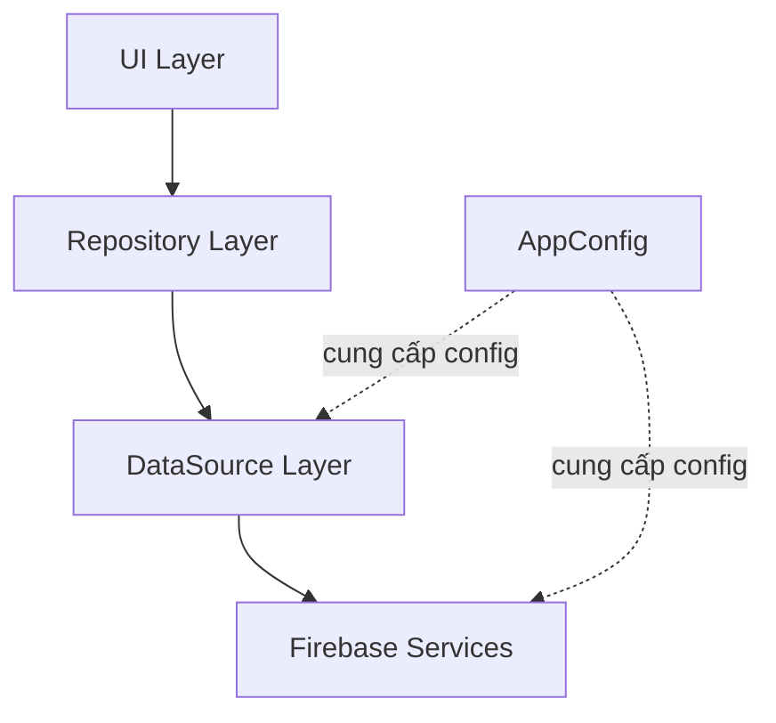

# Kế Hoạch Phát Triển Ứng Dụng Quản Lý Chi Tiêu

## Tổng Quan Kiến Trúc



**Tech Stack:**

- Java 17, XML Layout, Material Design
- Firebase Authentication (Email/Password)
- Cloud Firestore (realtime database)
- Clean Architecture với phân tầng rõ ràng

**Package Name:** `com.dammanhdungvn.quanlychitieucanhan` (đồng bộ với Firebase)

---

## Phase 1: Cleanup & Project Setup

### 1.1 Xóa Code Cũ

Xóa toàn bộ các file Java cũ trong `app/src/main/java/com/example/myapplication/`:

- [FirstFragment.java](app/src/main/java/com/example/myapplication/FirstFragment.java)
- [SecondFragment.java](app/src/main/java/com/example/myapplication/SecondFragment.java)
- [MainActivity.java](app/src/main/java/com/example/myapplication/MainActivity.java)

Xóa các layout không cần thiết:

- [fragment_first.xml](app/src/main/res/layout/fragment_first.xml)
- [fragment_second.xml](app/src/main/res/layout/fragment_second.xml)
- [content_main.xml](app/src/main/res/layout/content_main.xml)

### 1.2 Update Package Name

Đổi toàn bộ package từ `com.example.myapplication` sang `com.dammanhdungvn.quanlychitieucanhan`:

- Tạo cấu trúc thư mục mới trong `app/src/main/java/`
- Update [AndroidManifest.xml](app/src/main/AndroidManifest.xml)
- Update [build.gradle.kts](app/build.gradle.kts) (applicationId)

### 1.3 Firebase Configuration

- Di chuyển [google-services.json](app/src/firebase/google-services.json) từ `app/src/firebase/` đến `app/google-services.json` (vị trí chuẩn)
- Cập nhật [build.gradle.kts](app/build.gradle.kts) với Firebase dependencies:
  ```
  - firebase-bom (Bill of Materials)
  - firebase-auth
  - firebase-firestore
  - com.google.gms:google-services plugin
  ```


---

## Phase 2: Configuration Layer

### 2.1 Centralized Config

Tạo `app/src/main/java/com/dammanhdungvn/quanlychitieucanhan/config/AppConfig.java`:

- Quản lý collection names (USERS_COLLECTION, TRANSACTIONS_SUBCOLLECTION)
- Environment flags (IS_DEBUG, ENABLE_LOGGING)
- Feature flags (ENABLE_OFFLINE_MODE)
- Transaction types constants (TYPE_INCOME, TYPE_EXPENSE)
- Đọc giá trị từ BuildConfig khi cần

**Nguyên tắc:** Không hard-code string literals ở bất kỳ layer nào khác.

---

## Phase 3: Data Layer

### 3.1 Models

Tạo các POJO trong `data/model/`:

- **User.java**: userId, email, displayName, createdAt
- **Transaction.java**: transactionId, amount, type, category, note, date, createdAt
- **Category.java**: categoryId, name, type (predefined/custom), iconName
- **MonthlyStats.java**: totalIncome, totalExpense, balance, month, year

### 3.2 Firebase Managers

Tạo các manager class trong `firebase/`:

**AuthManager.java**: Singleton pattern

- `signUpWithEmail(email, password, displayName, callback)`
- `signInWithEmail(email, password, callback)`
- `signOut()`
- `getCurrentUser()`
- `isUserLoggedIn()`
- Tự động tạo user document trong Firestore sau khi đăng ký

**FirestoreManager.java**: Singleton pattern

- Transaction CRUD:
                                                                - `addTransaction(transaction, callback)`
                                                                - `updateTransaction(transactionId, transaction, callback)`
                                                                - `deleteTransaction(transactionId, callback)`
                                                                - `getTransactions(userId, listener)` - realtime listener
                                                                - `getTransactionsByMonth(userId, month, year, listener)`
- Category management:
                                                                - `getCategories(userId, callback)` - lấy predefined + custom categories
                                                                - `addCustomCategory(userId, category, callback)`
- Statistics:
                                                                - `getMonthlyStats(userId, month, year, callback)`

**Lưu ý:** Tất cả collection/subcollection paths phải dùng từ AppConfig.

### 3.3 Repository Layer

Tạo `data/repository/`:

**TransactionRepository.java**: Trung gian giữa UI và FirestoreManager

- Xử lý data transformation (Firestore Document <-> Model)
- Caching strategy (nếu cần)
- Error handling & logging

**CategoryRepository.java**: Quản lý danh sách categories

- Merge predefined categories với custom categories
- Predefined categories: Ăn uống, Di chuyển, Học tập, Giải trí, Sức khỏe, Mua sắm, Tiền lương, Đầu tư, Khác

---

## Phase 4: Business Logic & Utils

### 4.1 Utils

Tạo `utils/`:

- **DateUtils.java**: Format date, get current month/year, date comparison
- **ValidationUtils.java**: Validate email, password, amount (>0), note length
- **CurrencyUtils.java**: Format số tiền theo định dạng VND (hoặc configurable)
- **DialogUtils.java**: Helper để show loading, error, confirmation dialogs

### 4.2 Predefined Data

Tạo `data/datasource/PredefinedCategories.java`:

- Danh sách categories mặc định cho thu nhập và chi tiêu
- Icon mapping (sử dụng Material Icons hoặc drawable resources)

---

## Phase 5: UI Layer

### 5.1 Authentication Screens

**LoginActivity.java** + `res/layout/activity_login.xml`:

- Email input (TextInputLayout)
- Password input (TextInputLayout)
- Login button
- Register link
- Error handling với Snackbar
- Loading state (ProgressBar)

**RegisterActivity.java** + `res/layout/activity_register.xml`:

- Display name input
- Email input
- Password input
- Confirm password input
- Register button
- Login link
- Validation trước khi submit

**SplashActivity.java** + `res/layout/activity_splash.xml`:

- Check authentication state
- Navigate to Login hoặc Main
- Show app logo

### 5.2 Main Screen

**MainActivity.java**: Container với BottomNavigationView

- 3 tabs: Home, Transactions, Profile

**HomeFragment.java** + `res/layout/fragment_home.xml`:

- CardView hiển thị thống kê tháng hiện tại:
                                                                - Tổng thu
                                                                - Tổng chi
                                                                - Số dư (thu - chi)
- RecyclerView danh sách transactions gần đây (10 items)
- FloatingActionButton để thêm transaction
- Realtime update từ Firestore

### 5.3 Transaction Management

**TransactionListFragment.java** + `res/layout/fragment_transaction_list.xml`:

- RecyclerView với adapter: TransactionAdapter
- Item layout: `res/layout/item_transaction.xml`
                                                                - Icon category
                                                                - Category name
                                                                - Note
                                                                - Amount (màu đỏ cho expense, xanh cho income)
                                                                - Date
- Swipe to delete với ItemTouchHelper
- Click để edit
- Filter by month (optional dialog)

**AddEditTransactionActivity.java** + `res/layout/activity_add_edit_transaction.xml`:

- Amount input (TextInputLayout với inputType="numberDecimal")
- Type selection (RadioGroup: Thu nhập / Chi tiêu)
- Category spinner (load từ CategoryRepository)
- Link "Thêm danh mục mới" (mở dialog)
- Note input (TextInputLayout, multiline)
- Date picker (DatePickerDialog)
- Save button
- Validation trước khi save

**AddCategoryDialog.java**: DialogFragment

- Category name input
- Type (income/expense) - auto từ context
- Save vào Firestore dưới user document

### 5.4 Profile Screen

**ProfileFragment.java** + `res/layout/fragment_profile.xml`:

- Display user info (email, displayName)
- Settings section (placeholder cho tương lai)
- Logout button với confirmation dialog

---

## Phase 6: Resources & Styling

### 6.1 Colors ([values/colors.xml](app/src/main/res/values/colors.xml))

```xml
<color name="primary">#1976D2</color>
<color name="primary_dark">#1565C0</color>
<color name="accent">#FFC107</color>
<color name="income_color">#4CAF50</color>
<color name="expense_color">#F44336</color>
<color name="background">#F5F5F5</color>
```

### 6.2 Strings ([values/strings.xml](app/src/main/res/values/strings.xml))

- Tất cả text trong app phải là string resource
- Tiếng Việt
- Không hard-code text trong Java code

### 6.3 Dimensions ([values/dimens.xml](app/src/main/res/values/dimens.xml))

- Spacing chuẩn: 8dp, 16dp, 24dp
- Text sizes
- Card elevation

### 6.4 Themes ([values/themes.xml](app/src/main/res/values/themes.xml))

- Material Design 3 components
- DayNight theme support

---

## Phase 7: Manifest & Permissions

Update [AndroidManifest.xml](app/src/main/AndroidManifest.xml):

- Internet permission
- Đăng ký tất cả Activities
- Set SplashActivity làm LAUNCHER
- Set parent activities cho navigation

---

## Phase 8: Testing & Build

### 8.1 Build Validation

```bash
./gradlew clean
./gradlew installDebug
```

### 8.2 Manual Testing Checklist

- Đăng ký user mới
- Đăng nhập
- Thêm transaction (income)
- Thêm transaction (expense)
- Xem statistics update realtime
- Edit transaction
- Delete transaction
- Thêm custom category
- Đăng xuất
- Đăng nhập lại → data vẫn còn

### 8.3 Error Handling

- Network errors
- Firebase exceptions
- Validation errors
- Empty states

---

## Implementation Notes

### Firestore Schema Compliance

```
users/{userId}
  ├── email: string
  ├── displayName: string
  ├── createdAt: timestamp
  └── transactions/{transactionId}
       ├── amount: number
       ├── type: "income" | "expense"
       ├── category: string
       ├── note: string
       ├── date: timestamp
       ├── createdAt: timestamp
```

### Code Quality Standards

- Comment tiếng Việt tại các điểm quan trọng
- Naming convention: camelCase cho methods/variables, PascalCase cho classes
- Error handling: try-catch với logging
- Null safety: kiểm tra null trước khi sử dụng
- Memory leaks: detach listeners trong onDestroy/onStop

### Configuration Management

Mọi truy cập Firebase PHẢI qua AppConfig:

```java
// BAD
db.collection("users").document(userId)...

// GOOD
db.collection(AppConfig.USERS_COLLECTION).document(userId)...
```

---

## Definition of Done

- [ ] Build thành công với `./gradlew installDebug`
- [ ] Tất cả features hoạt động đúng
- [ ] UI/UX chuyên nghiệp, không sơ sài
- [ ] Code clean, có comments tiếng Việt
- [ ] Không hard-code config
- [ ] Error handling đầy đủ
- [ ] Realtime updates hoạt động
- [ ] Data persistence sau khi logout/login

Note: Firebase cung cấp thông tin sau:

1. To make the google-services.json config values accessible to Firebase SDKs, you need the Google services Gradle plugin.

Kotlin DSL (build.gradle.kts)

Groovy (build.gradle)

Add the plugin as a dependency to your project-level build.gradle.kts file:

Root-level (project-level) Gradle file (<project>/build.gradle.kts):

id("com.google.gms.google-services") version "4.4.4" apply false

2. Then, in your module (app-level) build.gradle.kts file, add both the google-services plugin and any Firebase SDKs that you want to use in your app:

Module (app-level) Gradle file (<project>/<app-module>/build.gradle.kts):

id("com.android.application")

id("com.google.gms.google-services")

implementation(platform("com.google.firebase:firebase-bom:34.7.0"))

implementation("com.google.firebase:firebase-analytics")